# AlphaForge

AlphaForge is an end-to-end quantitative machine learning research platform for building, validating, and backtesting multi-horizon alpha signals on public or synthetic market data.

It is designed to look and behave like a small professional research stack rather than a notebook-only demo: canonical long-format OHLCV data, causal feature engineering, forward labels, embargoed walk-forward validation, out-of-sample prediction panels, signal and portfolio construction, realistic transaction costs, risk analytics, reports, a dashboard, and an API.

AlphaForge is an educational quantitative research and ML engineering project. It is not financial advice, does not guarantee profitability, and should not be used to trade real money without professional review, additional validation, and appropriate risk controls. Backtests are not live results and may not predict future performance.

## What It Demonstrates

- Public market data engineering with yfinance, CSV, and synthetic sources.
- Leak-safe feature engineering on a canonical `(date, symbol, OHLCV)` panel.
- Multi-horizon labels such as forward returns, direction, ranks, and excess returns.
- Walk-forward model training with an embargo at least as large as the longest label horizon.
- Baselines, linear models, tree models, optional torch models, and ensembles.
- Backtests that use out-of-sample predictions only.
- Next-bar execution assumptions, turnover, commission, spread, and slippage.
- Portfolio caps, inverse-vol sizing, turnover controls, and volatility targeting.
- Risk metrics, stress summaries, reporting, API endpoints, and paper-trading replay.

## Architecture

```mermaid
flowchart LR
    A[Raw data: yfinance / CSV / synthetic] --> B[Validation and quality report]
    B --> C[Leak-safe feature engineering]
    C --> D[Multi-horizon forward labels]
    D --> E[Walk-forward splits with embargo]
    E --> F[Model training and OOS predictions]
    F --> G[Signal construction]
    G --> H[Portfolio construction]
    H --> I[Backtest: next-bar execution and costs]
    I --> J[Risk and performance analytics]
    J --> K[Report / dashboard / API / paper sim]
```



## Quickstart

```bash
make install
make test
make demo
```

The demo is fully offline. It generates synthetic market data, trains a small walk-forward experiment, runs an out-of-sample backtest, and writes a markdown report under `runs/`.

Useful commands:

```bash
make download-data      # yfinance / CSV / synthetic per configs/data.yaml
make build-features     # feature and label panels
make walk-forward       # model comparison with OOS predictions
make backtest           # OOS portfolio backtest
make paper              # simulated paper-trading replay only
make report             # markdown report
make dashboard          # Streamlit dashboard
make api                # FastAPI service
```

## Honesty Guarantees

- Every module consumes the same canonical long-format panel.
- Feature functions are causal; tests mutate future data and assert past features do not change.
- Backtests consume only out-of-sample walk-forward predictions.
- Walk-forward splits reject embargo settings shorter than the longest label horizon.
- Execution requires `execution_lag >= 1`; no same-close fills are allowed.
- Transaction costs are charged on traded notional through commission, half-spread, and slippage.

## Repository Map

- `alphaforge/data`: loaders, schema validation, quality reports, synthetic data.
- `alphaforge/features`: technical, cross-sectional, benchmark-relative, and regime features.
- `alphaforge/labels`: multi-horizon forward labels.
- `alphaforge/models`: baselines, sklearn wrappers, torch wrappers, ensemble, registry.
- `alphaforge/training`: walk-forward splitting, model training, OOS prediction panels.
- `alphaforge/signals`: rank, long-short, top-k, and threshold signals.
- `alphaforge/portfolio`: capped, inverse-vol, turnover-aware target weights.
- `alphaforge/backtesting`: vectorized next-bar backtest with costs.
- `alphaforge/risk`: performance, drawdown, VaR, expected shortfall, stress summaries.
- `alphaforge/paper`: simulated paper-trading replay.
- `scripts`: command-line pipeline entry points.
- `apps`: Streamlit and FastAPI entry points.
- `docs`: methodology, limitations, model card, and career collateral.
- `tests`: leakage, label alignment, split embargo, backtest cost, and pipeline tests.

## Example Output

After `make demo`, inspect:

- `runs/latest_run.txt`
- `model_metrics.csv`
- `walk_forward_windows.csv`
- `equity_curve.csv`
- `backtest_summary.json`
- `report.md`

Results from synthetic data are for engineering verification only. They are not evidence of live profitability.
