# AlphaForge

AlphaForge is an end-to-end quantitative machine learning research platform for building, validating, and backtesting multi-horizon alpha signals on public or synthetic market data.

It is designed to look and behave like a small professional research stack rather than a notebook-only demo: canonical long-format OHLCV data, causal feature engineering, forward labels, embargoed walk-forward validation, out-of-sample prediction panels, signal and portfolio construction, realistic transaction costs, risk analytics, reports, a dashboard, and an API.

AlphaForge is an educational quantitative research and ML engineering project. It is not financial advice, does not guarantee profitability, and should not be used to trade real money without professional review, additional validation, and appropriate risk controls. Backtests are not live results and may not predict future performance.

## What It Demonstrates

- Public market data engineering with yfinance, CSV, and synthetic sources.
- Leak-safe feature engineering on a canonical `(date, symbol, OHLCV)` panel.
- A 2-state Gaussian HMM regime engine (custom Baum-Welch EM) used strictly causally:
  expanding parameter refits + filtered (never smoothed) state probabilities.
- Multi-horizon labels such as forward returns, direction, ranks, and excess returns.
- Walk-forward model training with an embargo at least as large as the longest label horizon.
- Purged K-Fold and Combinatorial Purged CV (CPCV) splitters for overlap-safe evaluation.
- Baselines, linear models, tree models, optional torch models, and an IC-weighted ensemble.
- Overfitting statistics: Probabilistic and Deflated Sharpe Ratios, Probability of
  Backtest Overfitting (CSCV), and Newey-West IC t-statistics.
- Backtests that use out-of-sample predictions only.
- Next-bar execution assumptions, turnover, commission, spread, and slippage —
  including costed turnover from volatility-targeting and drawdown-control trades.
- Portfolio caps, inverse-vol sizing, turnover controls, and regime-aware exposure.
- Risk metrics, beta-aware stress tests, regime-conditional performance, reporting,
  API endpoints, and paper-trading replay.
- A C++17 limit-order-book execution core with pybind11 bindings, a parity-tested
  pure-Python reference implementation, and reproducible latency benchmarks.

## Architecture

```mermaid
flowchart LR
    A[Raw data: yfinance / CSV / synthetic] --> B[Validation and quality report]
    B --> C[Leak-safe feature engineering]
    C --> D[Multi-horizon forward labels]
    D --> E[Walk-forward splits with embargo]
    E --> F[Model training and OOS predictions]
    F --> G[Signal construction]
    G --> H[Portfolio construction]
    H --> I[Backtest: next-bar execution and costs]
    I --> J[Risk and performance analytics]
    J --> K[Report / dashboard / API / paper sim]
```



## Quickstart

```bash
make install
make test
make demo
```

The demo is fully offline. It generates synthetic market data, trains a small walk-forward experiment, runs an out-of-sample backtest, and writes a markdown report under `runs/`.

Useful commands:

```bash
make download-data      # yfinance / CSV / synthetic per configs/data.yaml
make build-features     # feature and label panels
make walk-forward       # model comparison with OOS predictions
make backtest           # OOS portfolio backtest
make paper              # simulated paper-trading replay only
make report             # markdown report
make dashboard          # Streamlit dashboard
make api                # FastAPI service
```

## Low-Latency Execution Core (C++)

`cpp/` contains a price-time-priority limit order book and depth-aware fill
simulator written in C++17 (header-only, no dependencies), exposed to Python via
pybind11 and backed by a pure-Python reference implementation with identical
semantics. Parity tests drive both engines with the same random order flow and
require bit-identical fills, depth, and book state.

Measured on an Apple M-series laptop (`make bench-native`, 2M mixed ops:
55% add / 30% cancel / 15% market):

| metric | value |
|---|---|
| throughput | ~6.2M ops/s |
| latency p50 | ~125 ns |
| latency p99 | ~583 ns |
| pure-Python reference | ~1.1M ops/s |

Honest framing: the daily-bar research pipeline does not need nanosecond
matching. The native core exists to (a) replace flat-bps slippage with
depth-aware fill simulation in the paper trader, and (b) demonstrate the
systems side of trading infrastructure — data-structure design (intrusive
lists + price-level maps + O(1) cancel index), integer-tick determinism, FFI,
and cross-implementation testing.

```bash
make native        # build the pybind11 extension in-place
make bench         # Python vs C++ comparison (binding overhead included)
make bench-native  # pure C++ benchmark with latency percentiles
```

## Validation Science

Backtest results are only as good as the validation that produced them.
AlphaForge ships the modern anti-overfitting toolkit and wires it into every run:

- **Purged K-Fold & CPCV** (`alphaforge/training/purged_cv.py`): overlapping
  labels demand purging around test blocks plus an embargo; CPCV evaluates all
  C(n, k) test-group combinations to produce many OOS paths instead of one.
- **Deflated Sharpe Ratio** (`alphaforge/evaluation/overfitting.py`): P(true
  Sharpe > 0) after correcting for multiple testing (best-of-N selection),
  sample length, skew, and fat tails. Reported in every backtest summary with
  `n_trials` set to the number of competing model variants.
- **Probability of Backtest Overfitting** (CSCV): how often the in-sample
  winner underperforms the median out-of-sample, computed across models from
  their daily rank-IC panels.
- **Newey-West IC t-statistics**: multi-day labels overlap, so IC series are
  serially correlated; naive t-stats overstate significance.

## Honesty Guarantees

- Every module consumes the same canonical long-format panel.
- Feature functions are causal; tests mutate future data and assert past features do not change.
- Backtests consume only out-of-sample walk-forward predictions.
- Walk-forward splits reject embargo settings shorter than the longest label horizon.
- Execution requires `execution_lag >= 1`; no same-close fills are allowed.
- Transaction costs are charged on traded notional through commission, half-spread, and slippage.

## Repository Map

- `alphaforge/data`: loaders, schema validation, quality reports, synthetic data.
- `alphaforge/features`: technical, cross-sectional, benchmark-relative, and regime features.
- `alphaforge/labels`: multi-horizon forward labels.
- `alphaforge/models`: baselines, sklearn wrappers, torch wrappers, IC-weighted ensemble,
  Gaussian HMM regime model, registry.
- `alphaforge/training`: walk-forward splitting, purged K-Fold, CPCV, OOS prediction panels.
- `alphaforge/evaluation`: IC analytics, PSR/DSR, PBO, Newey-West inference.
- `alphaforge/signals`: rank, long-short, top-k, threshold, confidence-weighted,
  and regime-filtered signals.
- `alphaforge/portfolio`: capped, inverse-vol, turnover-aware target weights.
- `alphaforge/backtesting`: vectorized next-bar backtest with costs (risk-overlay trades included).
- `alphaforge/risk`: performance, drawdown, VaR, expected shortfall, regime tables,
  beta-aware stress tests, concentration.
- `alphaforge/execution`: cost model, order books (Python + native loader), fill simulation.
- `alphaforge/paper`: simulated paper-trading replay.
- `cpp/`: C++17 order book, pybind11 bindings, CMake project, native benchmark.
- `scripts`: command-line pipeline entry points.
- `apps`: Streamlit and FastAPI entry points.
- `docs`: methodology, limitations, model card, and career collateral.
- `tests`: leakage, label alignment, split embargo, backtest cost, and pipeline tests.

## Example Output

After `make demo`, inspect:

- `runs/latest_run.txt`
- `model_metrics.csv`
- `walk_forward_windows.csv`
- `equity_curve.csv`
- `backtest_summary.json`
- `report.md`

Results from synthetic data are for engineering verification only. They are not
evidence of live profitability: the generator embeds a deliberately faint but
*clean* edge, so even honest pipelines earn flattering statistics on it. The
interesting outputs are the diagnostics — monotone prediction quantiles, IC
decay curves, Newey-West t-stats, PBO, and the deflated Sharpe — which show the
measurement machinery working.
