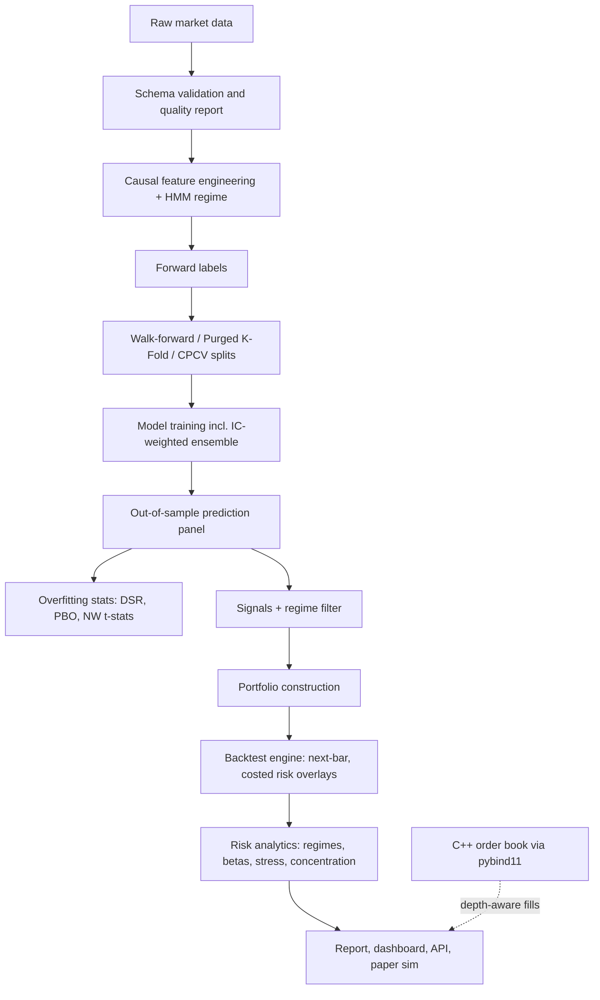

# Architecture

AlphaForge is a modular research pipeline:

The central contract is the canonical panel:

`date | symbol | open | high | low | close | volume`

Every downstream module either consumes this panel or a keyed derivative using
`(date, symbol)`. Backtests never train models and never use in-sample
predictions; they consume the saved OOS prediction panel from walk-forward
validation.

Two implementation layers sit beside the Python pipeline:

- **Native execution core** (`cpp/`): C++17 limit order book with pybind11
  bindings and a pure-Python reference implementation kept bit-identical by
  parity tests (docs/execution_engine.md).
- **Validation science** (`alphaforge/training/purged_cv.py`,
  `alphaforge/evaluation/overfitting.py`): purged/combinatorial splitters and
  the PSR/DSR/PBO statistics attached to every run report.
