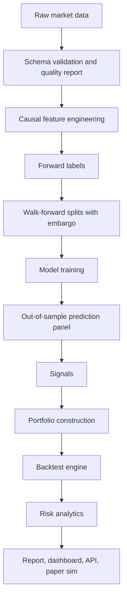

# Architecture

AlphaForge is a modular research pipeline:

The central contract is the canonical panel:

`date | symbol | open | high | low | close | volume`

Every downstream module either consumes this panel or a keyed derivative using `(date, symbol)`. Backtests never train models and never use in-sample predictions; they consume the saved OOS prediction panel from walk-forward validation.
