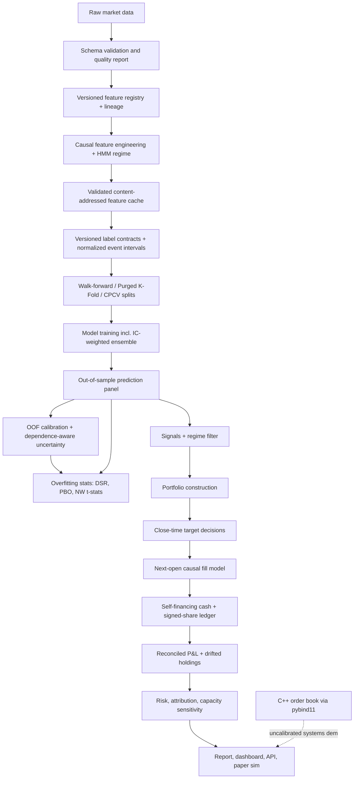

# Architecture

AlphaForge is a modular research pipeline:

```mermaid
flowchart TD
    raw[Raw market data] --> validate[Schema validation and quality report]
    validate --> registry[Versioned feature registry + lineage]
    registry --> features[Causal feature engineering + HMM regime]
    features --> cache[Validated content-addressed feature cache]
    cache --> labels[Versioned label contracts + normalized event intervals]
    labels --> splits[Walk-forward / Purged K-Fold / CPCV splits]
    splits --> models[Model training incl. IC-weighted ensemble]
    models --> preds[Out-of-sample prediction panel]
    preds --> calibration[OOF calibration + dependence-aware uncertainty]
    calibration --> overfit
    preds --> overfit[Overfitting stats: DSR, PBO, NW t-stats]
    preds --> signals[Signals + regime filter]
    signals --> portfolio[Portfolio construction]
    portfolio --> orders[Close-time target decisions]
    orders --> execution[Next-open causal fill model]
    execution --> ledger[Self-financing cash + signed-share ledger]
    ledger --> backtest[Reconciled P&L + drifted holdings]
    backtest --> risk[Risk, attribution, capacity sensitivity]
    risk --> outputs[Report, dashboard, API, paper sim]
    native[C++ order book via pybind11] -.uncalibrated systems demo.-> outputs
```

The central contract is the canonical panel:

`date | symbol | open | high | low | close | volume`

Every downstream module either consumes this panel or a keyed derivative using
`(date, symbol)`. Backtests never train models and never use in-sample
predictions; they consume the saved OOS prediction panel from walk-forward
validation.

Two implementation layers sit beside the Python pipeline:

- **Native execution core** (`cpp/`): C++17 limit order book with pybind11
  bindings and a pure-Python reference implementation kept bit-identical by
  parity tests (docs/execution_engine.md).
- **Historical execution and accounting** (`alphaforge/execution/models.py`,
  `alphaforge/backtesting/ledger.py`, `alphaforge/backtesting/engine.py`): typed
  order/fill contracts, lagged-liquidity next-open fills, signed shares and
  cash, and fail-closed P&L reconciliation. The timing decision is recorded in
  [ADR 0001](adr/0001-temporal-integrity.md).
- **Validation science** (`alphaforge/training/purged_cv.py`,
  `alphaforge/training/temporal_validation.py`,
  `alphaforge/evaluation/overfitting.py`): explicit development and inaccessible
  holdout roles, exact interval-aware purged/combinatorial splitters, immutable
  fold identities, and the PSR/DSR/PBO statistics attached to run evidence.
- **Feature trust boundary** (`alphaforge/features/registry.py`,
  `alphaforge/features/cache.py`, `alphaforge/features/transform.py`): exact
  semantic versions and schemas, content-bound lineage, verified immutable
  cache entries, and learned preprocessing fitted separately inside each
  temporal training fold.
- **Label trust boundary** (`alphaforge/labels/contracts.py`,
  `alphaforge/labels/diagnostics.py`): immutable semantic identities, explicit
  `(t,t+h]` future intervals, protected-boundary rejection, strict price/side
  availability, and dependence/balance/stability/sensitivity evidence. See
  [Financial label contracts and diagnostics](label_design.md).
- **Model governance boundary** (`alphaforge/models/base.py`,
  `alphaforge/models/sklearn_models.py`): typed resource bounds,
  train-fold-only estimator pipelines, explicit optional backends, immutable
  termination evidence, deterministic seed injection, and trusted-only binary
  deserialization. See
  [Governed benchmark models](governed_benchmark_models.md).
- **Calibration and uncertainty boundary**
  (`alphaforge/evaluation/calibration.py`,
  `alphaforge/evaluation/uncertainty.py`): training-OOF-only provenance,
  post-fit evaluation periods, strict probability metrics, JSON-safe
  Platt/isotonic state, moving-block bootstrap intervals, conservative
  block-conformal residual intervals, and bounded linear quantile regression.
  See [Calibration and uncertainty contracts](calibration_uncertainty.md).
- **Capacity evaluation** (`alphaforge/evaluation/capacity.py`): auditable AUM,
  participation, fill-ratio, and cost sensitivities using supplied lagged ADV.
