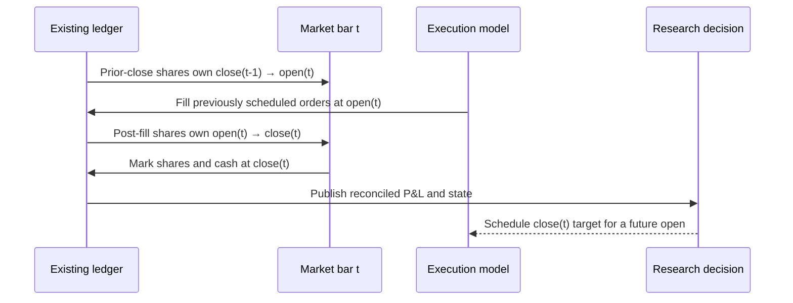

# Backtesting Methodology

AlphaForge uses a chronological, self-financing daily-bar simulator. Saved
out-of-sample predictions produce target weights at a session close; with the
default `execution_lag=1`, the resulting DAY orders fill no earlier than the
next session open.

## Event timeline

This ordering is an invariant, not a naming convention. A target formed with
close(t) information cannot capture the close(t)→open(t+1) gap because it does
not own shares until open(t+1). Tests use a 100→200 overnight gap with a flat
next session to enforce that behavior.

`execution_lag` counts trading sessions rather than calendar days. Target rows
are complete portfolio snapshots: a symbol omitted on a decision date has a
zero target and is liquidated at the next eligible fill. This prevents sparse
panels from silently preserving stale positions.

CLI research runs set `liquidate_at_end=true`: one forced zero target is
scheduled after the final signal/rebalance interval, the book closes at its
future-open fill, and the experiment stops. This prevents the last OOS signal
from becoming an undocumented buy-and-hold position after predictions end.

## Self-financing ledger

The accounting state is signed shares plus cash. Every fill applies

`cash_after = cash_before - signed_shares × fill_price - commission`

and every close satisfies

`equity = cash + Σ(shares × close)`.

Shares persist between rebalances. Their weights therefore drift with relative
returns; returning to the same target weights requires a real order, creates
turnover, and pays costs. Long purchases reduce cash, short sales increase
cash, and negative marked position values offset short-sale proceeds.

For each day the engine also verifies

`net P&L = overnight P&L + intraday P&L - execution costs`.

Symbol-level attribution reconciles to the same portfolio totals. Any breach
raises an exception instead of emitting results.

## Causal execution and costs

Daily-bar fills use the next open as their reference price. The model separates:

- commission, debited directly from cash;
- half-spread and fixed slippage, embedded in the fill price; and
- square-root impact sensitivity based on lagged volatility and participation.

Participation caps use average daily volume shifted one full session before
the fill. The execution-day full volume is never available at the open and is
never used. A DAY order above the configured cap partially fills; its residual
quantity is reported and expires rather than being silently treated as filled.
Missing required open or close prices fail visibly.

The impact coefficient is a documented sensitivity, not a fitted claim about
market impact. The C++ order book is likewise an uncalibrated systems component
and is not used to reconstruct historical daily-bar fills.

## Risk overlays

Volatility targeting and drawdown controls are frozen with the close-time
decision using only realized portfolio history through that close. The scale
therefore affects a future fill. Because overlays change requested holdings,
their rebalances pass through the same ledger and cost model as every other
trade. Drawdown control uses the realized controlled equity path, including
feedback from earlier interventions.

## Capacity sensitivity

The capacity curve scales observed desired/fill notionals across explicit AUM
scenarios, caps each row by caller-supplied lagged ADV, and applies a transparent
power-law cost sensitivity. It returns both aggregate and row-level tables so
each point reconciles. These are scenario sensitivities—not deployable-AUM
forecasts, guarantees, or a substitute for calibrated order-level data.

## Artifacts

Each completed backtest writes:

- `equity_curve.csv`: cash, equity, market P&L, cost, returns, turnover, and exposures;
- `orders.csv` / `fills.csv`: decision and fill dates, quantities, prices, liquidity,
  participation, residuals, and cost components;
- `executed_weights.csv`: signed shares, marked values, drifted weights, and targets;
- `pnl_attribution.csv`: overnight/intraday market P&L and costs by symbol;
- `capacity_curve.csv` / `capacity_scenarios.csv`: aggregate and row-level sensitivities;
- `capacity_diagnostics.json`: data provenance and interpretation guardrails.

Performance metrics start with the first non-zero exposure. Sharpe and Sortino
use arithmetic daily means annualized by √252; annual return is geometric.
Deflated Sharpe uses the number of model variants visible to the run, while the
limitations document states why that cannot account for uncoded experiments.
